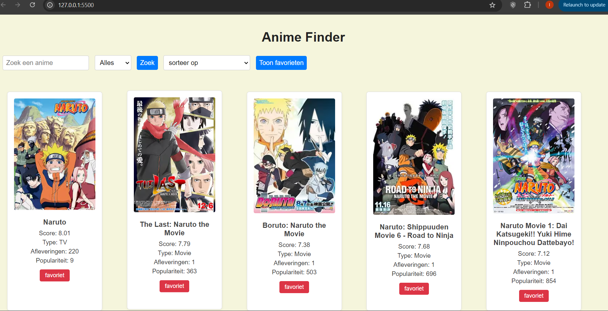
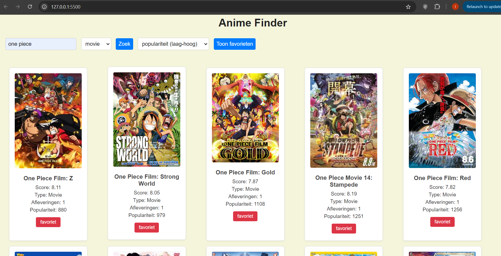
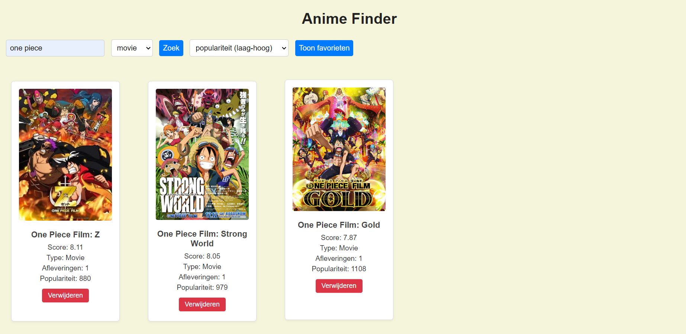

<h1>Anime Finder – Web Advanced Project</h1>

Dit is een interactieve single-page webapplicatie die anime opzoekt via de [Jikan API](https://docs.api.jikan.moe/).  
Gebruikers kunnen zoeken op naam, filteren op type, sorteren op score, afleveringen of populariteit en hun favoriete anime opslaan of verwijderen uit localStorage.

<h2>🔍 Functionaliteiten</h2>

- 🔎 Zoeken op titel
- 🧩 Filteren op type anime (TV, Movie, Special)
- ↕️ Sorteren op titel, score, populariteit of afleveringen
- ❤️ Favorieten opslaan via localstorage
- 🗑️ Favorieten verwijderen
- 📄 Favorieten tonen op de pagina
- 🔁 Data ophalen via externe API (Jikan)

<h2>⚙️ Technische vereisten toegepast</h2>

| Vereiste                         | lijnnummers    | Waar in code?                                  
|----------------------------------|----------------|------------------------------------------------
| ✅ Elementen selecteren          |26,30          | `document.getElementById`, `createElement`     
| ✅ Elementen manipuleren         |31,33,46       | `innerHTML`, `classList.add`, `appendChild`    
| ✅ Events koppelen               |45,80          | `addEventListener`                   
| ✅ Constanten (`const`)          |11,12,...      | overal in `main.js` gebruikt                   
| ✅ Template literals             |34-39,105-110  | HTML string met `...${anime.title}`                            
| ✅ Iteratie & array methodes     |29,17,68,73,125| `forEach`, `sort`, `some`, `push`, `filter`    
| ✅ Arrow functions               |45             | `() => {}` syntax                    
| ✅ Ternary operator              |36,107         | `anime.score || "Geen score"`                  
| ✅ Callback functions            |29,100         | `animeList.forEach(anime => {...})`,`favorites.forEach(...) `          
| ✅ Promises & async/await        |2,11,12        | `async function`,`fetchAnime()` ,`await fetch()`
| ✅ Fetch & JSON                  |11,12          | `await fetch`, `.json()`                    
| ✅ LocalStorage                  |66,74,         | `getItem`, `setItem`, `JSON.stringify`                 
| ❌ Formulier validatie           | \              | niet gedaan                                    
| ✅ Styling & layout              | ✔             | `style.css`, grid layout, kleuren, knoppen     
| ✅ Tooling: Vite project         | ✔             | `npm create vite`, projectstructuur            
| ❌ Observer API                  | \              | Niet gedaan                                    

<h2>📦 Installatiehandleiding</h2>

<h2>🌐 Gebruikte API</h2>

 - Jikan API – Unofficiële MyAnimeList API
     https://docs.api.jikan.moe

 <h2>🖼️ Screenshots</h2>
   <h3>🔹 Startpagina</h3>
   

   <h3>🔹 Zoekresultaten</h3>
   

   <h3>🔹 Favorietenlijst</h3> 
   

 <h2>📚 Bronnen</h2>
 
